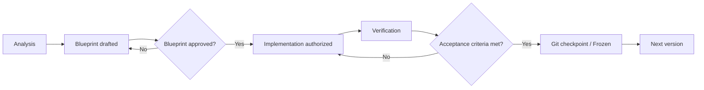

# GTAI Product Roadmap

Versioned delivery plan for GTAI (Global Travel AI). Each version is a single bounded objective with its own acceptance criteria and its own verified Git checkpoint.

This roadmap is the authority on **what version we are in and what is allowed next**. It does not restate requirements that belong in a blueprint.

---

## 1. Version status

### V1 — Global Foundation

|        |                                            |
| ------ | ------------------------------------------ |
| Status | **Frozen**                                 |
| Commit | `78b983c4aee6062b8faaf149bf3f79d5f3adcfe2` |

Application architecture, routing, responsive shell, GTAI design system, localization for 32 locales, RTL foundation, country and currency architecture, homepage foundation, placeholder product pages, guided AI preview, documentation and the security baseline.

### V1.1 — Homepage Metasearch Alignment

|        |                                            |
| ------ | ------------------------------------------ |
| Status | **Frozen**                                 |
| Commit | `f5f6d8c2dda05919188f4bc1714559c690197c28` |

Homepage restructured so the standard travel search experience is the dominant above-the-fold element. Compact hero, single-row desktop search layout, non-wrapping product tabs, comparison reassurance row, removal of customer-facing implementation wording, and complete demonstration translations for the changed sections.

### V1.2 — Reference UX Blueprint

|        |                 |
| ------ | --------------- |
| Status | **In progress** |
| Commit | —               |

Documentation-only version. Produces the approved UX blueprints that later implementation versions must follow.

| Sub-version | Module                                | Status                                      | Commit                                     |
| ----------- | ------------------------------------- | ------------------------------------------- | ------------------------------------------ |
| V1.2-A      | Home Search Experience                | **Frozen**                                  | `feb07a7283c0951cc64e1a801c71993fcbd2d865` |
| V1.2-B      | Flight Search Form                    | **Documentation complete, awaiting freeze** | —                                          |
| V1.2-C      | Airport Selector                      | Pending analysis                            | —                                          |
| V1.2-D      | Date Picker and Flexible Dates        | Pending analysis                            | —                                          |
| V1.2-E      | Flight Results                        | Pending analysis                            | —                                          |
| V1.2-F      | Filters and Sorting                   | Pending analysis                            | —                                          |
| V1.2-G      | Flight Details and Affiliate Redirect | Pending analysis                            | —                                          |

---

## 2. Future versions

High-level intent only. Detailed requirements are deliberately **not** defined here — each version gets its own approved blueprint before any implementation begins.

| Version | Title                               | Status  |
| ------- | ----------------------------------- | ------- |
| V2      | Functional Flight Search Foundation | Planned |
| V3      | Provider Adapter Integration        | Planned |
| V4      | Affiliate Redirect and Attribution  | Planned |
| V5      | Guided AI Travel Assessment         | Planned |
| V6      | AI Result Intelligence              | Planned |
| V7      | Stays                               | Planned |
| V8      | Cars                                | Planned |
| V9      | Packages                            | Planned |
| V10     | Trust, Risk and Monitoring          | Planned |

> **Version numbering may be refined after each approved blueprint.** A blueprint can reveal that a version is too large, too small, or ordered wrongly. Renumbering is expected and is not a failure — but it must be recorded here, and a frozen version is never renumbered retroactively.

---

## 3. Project rules

These rules govern every version and every contributor, human or automated.

### Process

1. **Analyze before implementation.** Understanding precedes code.
2. **One bounded objective per version.** A version that does two things is two versions.
3. **Every version requires explicit acceptance criteria**, written before work starts.
4. **No production implementation before its blueprint is approved.**
5. **Every frozen version must have a verified local Git checkpoint**, recorded in section 1 with its commit SHA.

### Provider and data

6. **No provider integration without official permission**, an approved API, an affiliate relationship or a licensed feed.
7. **No unauthorized scraping**, and no circumvention of provider protections, rate limits or terms.

### AI

8. **No unrestricted AI free-text trip planning as the primary GTAI AI workflow.**
9. **AI planning is structured, adaptive and multi-agent.**

### Product

10. **Standard travel search remains the primary entry path.** AI enhances it; AI never replaces it or stands in front of it.

---

## 4. Version lifecycle

A version may only move from **Blueprint** to **Implementation authorized** through explicit approval. An implementation agent that has not been given an approved blueprint has no authority to design product behaviour.

---

## 5. Related documentation

| Document                                        | Purpose                                                                  |
| ----------------------------------------------- | ------------------------------------------------------------------------ |
| `docs/reference/V1_2_REFERENCE_UX_BLUEPRINT.md` | Master index and global principles for the V1.2 blueprint modules        |
| `docs/reference/01_HOME_SEARCH_EXPERIENCE.md`   | Frozen V1.2-A Home Search Experience blueprint                           |
| `docs/reference/02_FLIGHT_SEARCH_FORM.md`       | Approved V1.2-B Flight Search Form blueprint                             |
| `docs/architecture/V1_FOUNDATION.md`            | V1 architecture, routing, localization, region and currency rules        |
| `docs/architecture/REFERENCE_POLICY.md`         | Which products inform GTAI's UX, and the hard line on copying            |
| `docs/design-system/GTAI_DESIGN_SYSTEM.md`      | Palette, tokens, typography, elevation, motion, accessibility, RTL rules |
