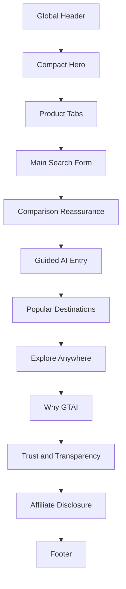
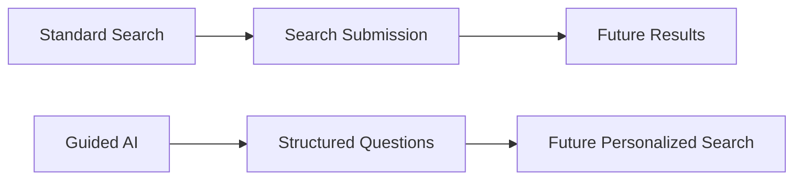
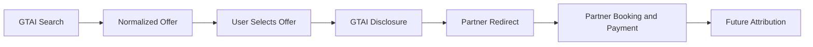

# GTAI V1.2-A — Home Search Experience Blueprint

**Module:** 01 of 07
**Status:** **Approved for documentation.** Not approved for functional implementation beyond the existing V1.1 presentation layer.
**Base checkpoint:** `f5f6d8c2dda05919188f4bc1714559c690197c28`
**Index:** `docs/reference/V1_2_REFERENCE_UX_BLUEPRINT.md`

---

## 1. Product purpose

The GTAI homepage must immediately communicate that GTAI is a **global travel comparison and metasearch platform**.

Within approximately **two seconds**, the traveller must understand that they can search and compare:

- Flights
- Stays
- Cars
- Packages

The homepage must **not** initially resemble:

- a generic SaaS company
- an AI chatbot
- a traditional travel agency
- a software product landing page
- a promotional content portal

**Core priority:** Search first · AI second · Travel discovery third · Marketing last.

### 1.1 User intent

The traveller arriving at the homepage is in one of three states:

| Intent                                       | Entry path                              |
| -------------------------------------------- | --------------------------------------- |
| I know where and roughly when I am going     | Standard search form                    |
| I know I want a trip but not the shape of it | Guided AI entry                         |
| I have no destination in mind                | Popular Destinations / Explore Anywhere |

The layout must serve the first intent without any interaction, the second with one deliberate action, and the third by scrolling.

## 2. Final page order

| #   | Section                |
| --- | ---------------------- |
| 1   | Global Header          |
| 2   | Compact Hero           |
| 3   | Product Tabs           |
| 4   | Main Search Form       |
| 5   | Comparison Reassurance |
| 6   | Guided AI Entry        |
| 7   | Popular Destinations   |
| 8   | Explore Anywhere       |
| 9   | Why GTAI               |
| 10  | Trust and Transparency |
| 11  | Affiliate Disclosure   |
| 12  | Footer                 |

**No promotional banner, AI popup, account requirement or registration wall may appear before the main search form.**

### 2.1 Homepage information hierarchy

## 3. Global header

### 3.1 Desktop structure

| Region | Contents                                                                           |
| ------ | ---------------------------------------------------------------------------------- |
| Left   | GTAI logo; optional small "Global Travel AI" subtitle on sufficiently wide screens |
| Center | Flights · Stays · Cars · Packages · Explore                                        |
| Right  | AI Travel · Trips · Language selector · Country and Currency selector · Sign in    |

### 3.2 Header behavior

- approximately **64–72px** tall
- sticky, without becoming visually intrusive
- white or restrained translucent background
- subtle bottom border
- no heavy shadow
- active route clearly visible
- **do not use a fully purple header**
- keyboard accessible
- preserve visible focus
- retain correct RTL behavior

### 3.3 Mobile structure

- GTAI logo
- compact country/currency control
- profile placeholder
- menu button

Remaining navigation appears in an **accessible drawer**: focus trapped while open, Escape closes, focus returns to the menu button, background scroll locked.

## 4. Compact hero

**Approved headline:**

> Search globally. Travel intelligently.

**Approved supporting concept:**

> Compare flights, stays, cars and travel packages across trusted providers.

Final wording may be refined **only** if it preserves: search · global reach · comparison · intelligence · trust · brevity.

### 4.1 Requirements

- approximately **120–170px** tall on desktop
- title no more than **two lines** on mobile
- one short supporting sentence
- **visually subordinate to the search form**

### 4.2 The hero must not contain

- multiple benefit cards
- agent explanations
- version labels
- foundation messages
- "Coming soon" banners
- large airplane illustrations
- animated 3D globes
- chatbot input
- long promotional copy
- technical implementation wording

### 4.3 Decorative background

Subtle decorative travel or globe background elements are allowed **only if** they are lightweight, original, non-interactive, low contrast, hidden or simplified on mobile, and not visually dominant.

## 5. Product tabs

Required tabs: **Flights · Stays · Cars · Packages**

| Rule                  | Requirement                                                                                                            |
| --------------------- | ---------------------------------------------------------------------------------------------------------------------- |
| Default               | Flights selected                                                                                                       |
| Active state          | Clearly visible                                                                                                        |
| Mobile line behaviour | Tabs remain on one line                                                                                                |
| Narrow screens        | Controlled horizontal scrolling allowed at 360px                                                                       |
| Wrapping              | Not permitted                                                                                                          |
| Explore               | **Not a search tab** — it is a navigation destination                                                                  |
| Keyboard              | Full keyboard navigation required                                                                                      |
| ARIA                  | Correct tab relationships required (`tablist` / `tab` / `tabpanel`, `aria-selected`, `aria-controls`, roving tabindex) |
| Focus                 | Visible focus required                                                                                                 |
| Styling               | Transactional, not promotional                                                                                         |

## 6. Main flight search form

When **Flights** is active:

### 6.1 Settings row

- Round trip
- One way
- Multi-city
- Travelers
- Cabin class

### 6.2 Main row

- From
- Swap control
- To
- Departure
- Return
- Search

### 6.3 Layout by device

| Device  | Requirement                                                                                                                                                                                        |
| ------- | -------------------------------------------------------------------------------------------------------------------------------------------------------------------------------------------------- |
| Desktop | All primary fields in one coherent row · efficient horizontal use · **no isolated Cabin class second row** · equal visual field height · strong form grouping · Search CTA aligned with the fields |
| Tablet  | Balanced two-row layout allowed                                                                                                                                                                    |
| Mobile  | Fields stack cleanly · controls use full or near-full width · Search CTA full width · no page-level horizontal overflow · touch targets at least 44px                                              |

**The search form must be the strongest above-the-fold visual element.**

### 6.4 The form must not resemble

- a contact form
- unrelated cards
- excessive glassmorphism
- a collection of large isolated icon tiles

## 7. Field specification

### 7.1 From

|             |                          |
| ----------- | ------------------------ |
| Label       | From                     |
| Placeholder | Country, city or airport |

Future capabilities: city · airport · IATA code · all airports · nearby airports.

### 7.2 To

|             |                          |
| ----------- | ------------------------ |
| Label       | To                       |
| Placeholder | Country, city or airport |

Future capability: **Everywhere**.

### 7.3 Departure and Return

- display the selected date
- future price indicators belong to the **date-picker module (04)**, not here
- **do not show fake price data**

### 7.4 Travelers

Example summary: `1 adult`

### 7.5 Cabin class

- Economy
- Premium Economy
- Business
- First

### 7.6 Swap control

- placed logically between From and To
- keyboard accessible
- clear accessible name
- future behavior swaps origin and destination
- **must not rely only on an icon without accessible text**

## 8. Search CTA

**Approved Home label:** `Search`

The active product tab already communicates the search type, so the CTA does not need to name it.

Requirements:

- deep GTAI purple action color
- white accessible text
- same visual height as the form fields
- strong focus state
- future loading state
- full width on mobile
- no false result generation in presentation-only versions

Until functional search exists:

- clicking **may** show a truthful presentational notice
- **do not** display fabricated results
- **do not** display fabricated prices
- **do not** imply provider connectivity

## 9. Above-the-fold requirements

At **1440×900**, without scrolling:

- full header
- compact hero title
- product tabs
- full search form
- primary Search CTA

At **390×844**, immediately visible:

- header
- compact title
- product tabs
- beginning of the search form

The homepage must communicate travel search within approximately **two seconds**.

## 10. Comparison reassurance

Placed **immediately below the search form**. A compact row, **not** large cards.

Approved concepts:

- Compare providers
- See who offers each deal
- Book securely with the selected partner

> **Wording qualification.** The third concept describes the booking happening _on the partner's own platform_. It must never be phrased so that GTAI appears to provide, operate or warrant the security of the transaction — GTAI is not the merchant of record. Prefer phrasing that names the partner as the party completing the booking.

Rules:

- no unsupported "no markup" claim
- no guaranteed cheapest-price claim
- no false global-coverage claim
- no fake provider count
- no hidden affiliate relationship
- visually secondary to the search form

## 11. Guided AI entry

Placed **after** standard search and reassurance.

**Suggested title:** Build your perfect trip with GTAI

**Approved concept:**

> Answer a few guided questions and let GTAI refine the trip around budget, comfort, flexibility and travel requirements.

**CTA:** `Start guided planning`

### 11.1 The AI entry must explain structured choices covering

- purpose of travel
- budget
- date flexibility
- comfort
- stop preferences
- risk tolerance
- visa and transit concerns
- stay preferences
- transportation
- interests and activities

### 11.2 The AI entry must not include

- unrestricted text input
- chatbot textarea
- a "Describe your trip" box
- any false claim that production agents are active
- an AI interface larger than the standard search form

### 11.3 Recommended visual priority

| Surface         | Approximate weight |
| --------------- | ------------------ |
| Standard Search | ~70%               |
| AI Entry        | ~30%               |

### 11.4 User entry paths

> **Future behaviour.** The submission and results stages below do not exist today.

## 12. Progressive AI entry points

**Documented as future behavior only.** None of these may appear operational until implemented and verified.

| Moment                  | Concept                                                             |
| ----------------------- | ------------------------------------------------------------------- |
| After initial search    | _Want a better match? Answer 5 quick questions._                    |
| Inside results          | _Let GTAI rank these flights for you._                              |
| Before partner redirect | _Check transit, baggage, flexibility and risk before leaving GTAI._ |

## 13. Popular destinations

Placed after Guided AI Entry.

Future target:

- 6–8 destinations
- desktop: four cards per row
- tablet: two or three cards
- mobile: compact vertical layout or controlled horizontal carousel

Card data:

- city
- country
- optional real price **only when validated**
- licensed or original visual
- simple CTA

**Current static content must not imply live pricing.**

## 14. Explore anywhere

**Purpose:** support travellers without a fixed destination.

Future input concepts: origin · budget · travel month · trip duration · experience type.

Future output concepts: destination suggestions · map · estimated price range · entry requirements · weather · trust and risk overview.

**Do not implement this behavior in V1.2-A.**

## 15. Why GTAI

Maximum **six** informational cards:

1. Global comparison
2. Guided intelligent planning
3. Transparent affiliate model
4. Travel risk awareness
5. Personalized preferences
6. Continued trip support

Rules:

- no false clickable affordance
- no pointer cursor unless actionable
- no fake link
- future capabilities marked clearly
- no excessive marketing claims
- no internal architectural terminology in customer-facing copy

## 16. Trust and transparency

Maximum **five** principles:

- Provider transparency
- Understandable recommendations
- Visible affiliate relationships
- Privacy-conscious personalization
- User control over preferences

Avoid: legal guarantees · unverified security claims · guaranteed savings · guaranteed availability · guaranteed accuracy · unsupported ranking claims.

## 17. Affiliate disclosure

**Approved core wording:**

> GTAI compares offers from third-party travel providers. When you select an offer, you may be redirected to the provider to complete your booking. GTAI may receive a commission.

Requirements:

- visible on the homepage
- not hidden exclusively in the footer
- not forced through a disruptive popup
- not visually dominant
- clear partner-booking responsibility
- no claim that GTAI is merchant of record
- no claim that GTAI issues tickets
- no claim that prices are guaranteed
- no claim that every provider worldwide is connected

### 17.1 Future affiliate journey

> **Future behaviour.** No stage below exists today. No provider is connected and no affiliate link exists in the product.

## 18. Required future interaction states

**Documented, not implemented.**

| State                | Visible user feedback                       | Screen-reader announcement            | Keyboard behavior                                        | Recovery path                   | Input preserved |
| -------------------- | ------------------------------------------- | ------------------------------------- | -------------------------------------------------------- | ------------------------------- | --------------- |
| Default              | Resting field styling                       | None                                  | Standard tab order                                       | —                               | Yes             |
| Focused field        | Visible focus ring                          | Field label and value                 | Focus stays until moved                                  | —                               | Yes             |
| Dropdown open        | Panel visible, trigger marked expanded      | Expanded state and option count       | Arrow keys move, Escape closes, focus returns to trigger | Escape                          | Yes             |
| Validation error     | Message beside the field, non-colour signal | Error text, associated with the field | Focus moves to the first invalid field                   | Correct and resubmit            | Yes             |
| Loading              | Progress indicator on the CTA               | Polite "searching" announcement       | Controls disabled but focus retained                     | Cancel or wait                  | Yes             |
| No airport found     | Empty-result message inside the panel       | Result count of zero                  | Panel stays open, query editable                         | Edit query                      | Yes             |
| Offline              | Persistent, non-blocking notice             | Assertive connectivity notice         | No focus trap                                            | Retry when connectivity returns | Yes             |
| Provider unavailable | Named notice with alternatives              | Polite provider-unavailable notice    | Focus stays on results region                            | Retry or continue with others   | Yes             |
| Search submitted     | Transition to result surface                | Polite result-count announcement      | Focus moves to the results heading                       | Back returns to the form        | Yes             |
| Session restored     | Restored values shown with a subtle marker  | Polite "previous search restored"     | Standard tab order                                       | Clear and start over            | Yes             |

Every future state must specify all six columns above before implementation.

## 19. Accessibility

- real labels for all fields
- placeholder does not replace a label
- tabs controlled by keyboard
- Escape closes popup controls
- focus returns to the triggering element
- minimum 44px touch target
- errors not communicated by color alone
- visible focus
- correct heading hierarchy
- semantic landmarks
- screen-reader-readable route, dates and traveler summary
- RTL implemented with logical CSS properties
- reduced-motion support
- no inaccessible icon-only control

### 19.1 RTL behavior

- `dir` set server-side from locale metadata
- logical properties throughout — no physical `left`/`right` in components
- product tabs and search fields mirror in reading order
- the Search CTA lands at the inline-end of the field row
- the Swap control mirrors with the From/To pair
- numerals, IATA codes and currency codes stay LTR-isolated inside RTL text
- the mobile drawer anchors to the mirrored edge
- arrow-key tab navigation mirrors

## 20. Responsive behavior

| Width  | Header                                               | Hero                | Tabs                                    | Form                    | CTA                      | AI panel             | Section grids         | Footer            | RTL implications                                  |
| ------ | ---------------------------------------------------- | ------------------- | --------------------------------------- | ----------------------- | ------------------------ | -------------------- | --------------------- | ----------------- | ------------------------------------------------- |
| 360px  | Logo, compact currency, profile, menu; nav in drawer | Title max two lines | One line, controlled horizontal scroll  | Single column stack     | Full width               | Single column        | One column            | Stacked groups    | Drawer mirrors; tab scroll starts at inline-start |
| 390px  | As 360px                                             | Title max two lines | One line, no scroll expected in English | Single column stack     | Full width               | Single column        | One column            | Stacked groups    | As 360px                                          |
| 768px  | Compact header, drawer still used                    | Single line typical | One line                                | Balanced two-row layout | Full width of form group | Single or two column | Two columns           | Two column groups | Mirrored two-row order                            |
| 1024px | Full desktop nav appears                             | Single line         | One line                                | Single coherent row     | Aligned with fields      | Two column           | Two to three columns  | Multi-column      | Nav order mirrors                                 |
| 1280px | Full desktop nav                                     | Single line         | One line                                | Single coherent row     | Aligned with fields      | Two column           | Three columns         | Multi-column      | Nav order mirrors                                 |
| 1440px | Full desktop nav with optional logo subtitle         | Single line         | One line                                | Single coherent row     | Aligned with fields      | Two column           | Three to four columns | Multi-column      | Nav order mirrors                                 |

At every width: **no horizontal page overflow**, and the settings row never leaves a control isolated on a near-empty row.

## 21. Privacy and security

Homepage rules:

- no hidden fingerprinting
- no real IP geolocation in the presentation phase
- no passport collection
- no visa-history collection
- no payment data
- no health information
- no silent preference persistence
- no third-party tracking script
- no secrets exposed client-side
- no unsafe HTML injection
- no deceptive consent

## 22. Data requirements

Future **data categories** only. No production database schema and no provider-specific payloads are defined in this module.

| Category           | Notes                                        |
| ------------------ | -------------------------------------------- |
| locale             | Active language, from the URL                |
| selected country   | Visitor-chosen region                        |
| selected currency  | Visitor-chosen display currency              |
| active product tab | Flights · Stays · Cars · Packages            |
| trip type          | Round trip · One way · Multi-city            |
| origin             | Departure location                           |
| destination        | Arrival location                             |
| departure date     | Outbound date                                |
| return date        | Inbound date, round trip only                |
| traveler counts    | Passenger composition                        |
| cabin class        | Economy · Premium Economy · Business · First |

## 23. Analytics — future only

Candidate events, **documented with no implementation**:

`home_viewed` · `product_tab_selected` · `trip_type_selected` · `origin_opened` · `destination_opened` · `date_picker_opened` · `travelers_opened` · `cabin_class_opened` · `search_submitted` · `guided_ai_started` · `affiliate_disclosure_viewed`

Stated clearly:

- **No analytics is active in V1.2-A.**
- Consent and privacy rules must be defined **before** implementation.
- Events must not capture sensitive traveler details.

## 24. Original GTAI differentiation

The homepage distinguishes GTAI through:

- structured AI planning
- future adaptive question flow
- future specialized travel agents
- explainable recommendations
- trust and risk awareness
- visa and transit awareness
- personalized preferences
- continued trip support
- multilingual and RTL-ready experience
- transparent affiliate behavior

**These differentiators must not obstruct standard search.**

## 25. Explicit exclusions

V1.2-A does **not** implement:

airport autocomplete · airport database · date picker · price calendar · passenger selector · multi-city legs · flight API · hotel API · car API · search results · provider adapter · affiliate deep links · affiliate attribution · booking · payment · authentication · price alerts · AI questionnaire · production AI agents · database · analytics · cookies · geolocation · partner logos · live prices

## 26. Acceptance criteria

This blueprint is complete only when it specifies all of the following:

| #   | Requirement                     | Section  |
| --- | ------------------------------- | -------- |
| 1   | Exact homepage order            | 2        |
| 2   | Above-the-fold requirements     | 9        |
| 3   | Header inventory                | 3        |
| 4   | Compact hero behavior           | 4        |
| 5   | Product-tab behavior            | 5        |
| 6   | Flight-search controls          | 6, 7     |
| 7   | Search CTA behavior             | 8        |
| 8   | Reassurance content             | 10       |
| 9   | Guided AI placement             | 11       |
| 10  | Destination and Explore purpose | 13, 14   |
| 11  | Why GTAI limits                 | 15       |
| 12  | Trust limits                    | 16       |
| 13  | Affiliate disclosure            | 17       |
| 14  | Future states                   | 18       |
| 15  | Desktop behavior                | 6.3, 20  |
| 16  | Tablet behavior                 | 6.3, 20  |
| 17  | Mobile behavior                 | 6.3, 20  |
| 18  | RTL behavior                    | 19.1, 20 |
| 19  | Accessibility                   | 19       |
| 20  | Privacy                         | 21       |
| 21  | Security                        | 21       |
| 22  | Future analytics boundaries     | 23       |
| 23  | Implementation exclusions       | 25       |

> **Future implementation agents are not allowed to freely rearrange the homepage hierarchy without a newly approved blueprint revision.**

## 27. Open questions

Genuinely unresolved items only.

| #   | Question                                                    | Blocks                             |
| --- | ----------------------------------------------------------- | ---------------------------------- |
| 1   | Final production logo                                       | Brand freeze                       |
| 2   | Final production domain                                     | Canonical and `hreflang` metadata  |
| 3   | Final licensed destination-image source                     | Popular Destinations visuals       |
| 4   | Final legal disclosure wording                              | Legal review of section 17         |
| 5   | Final affiliate partners                                    | Provider adapter and redirect work |
| 6   | Final analytics and consent platform                        | Any analytics implementation       |
| 7   | Whether the production header remains sticky on all devices | Header implementation              |

## 28. Implementation prohibition

> **This blueprint authorizes documentation only. It does not authorize implementation of Airport Selector, Date Picker, Search Results, provider integration, booking, affiliate redirect, production AI or analytics.**

## Demonstration disclosure and product status (V2.8-A)

Directly beneath the search surface — before any reassurance copy — the homepage renders the shared `DemonstrationDataNotice` at `standard` weight. A visitor about to run a search learns what the results will be before they read anything about why GTAI is worth using.

A second, restrained card states that travel-provider integrations are being prepared: the product and its provider runtime are under development, live integrations require commercial and technical approval, and results stay demonstration-only until an approved integration is activated. It names no company, endpoint or internal detail.

The hero subtitle and the reassurance items were corrected in the same round. GTAI no longer describes itself as comparing "across trusted travel providers" in the present tense; it describes one comparison surface, states that integrations are being prepared, and says plainly that every provider named in today's results is a demonstration provider.

## Homepage metadata and locale fallback (V2.8-A round 2)

The homepage builds its metadata through the shared `buildPublicMetadata` helper rather than returning a bare title and description. Each authored locale gets a canonical (`/en`, `/fr`, `/fa`, `/ar`), `hreflang` alternates for the four authored locales plus `x-default` to English, Open Graph type/site name/title/description/url, a `summary` Twitter card, and `index, follow`.

The hero, the reassurance strip and the sample-destination section were corrected in V2.8-A round 3 to describe only what works today: a flight-comparison experience running on locally generated demonstration data, with stay, car and package integrations described as planned. The destination section is explicitly illustrative and states that it is not live popularity or trend data.

The homepage is indexable on all four authored locales. Flights is the only other product route that is — it has a working demonstration search — while Stays, Cars, Packages, Explore, Trips and AI Travel are public but `noindex` until they do something substantive. See section 17 of the V2.8-A implementation record for the full policy.

V2.8-A round 4 extended the same split to the seven static product pages, which had been passing the requested locale to `ProductPageShell` and so laid English prose out right-to-left on an unauthored RTL locale.

The homepage also honours the requested-locale / content-locale split: the dictionary and text direction come from the content locale, while the search form and every internal link keep the requested locale, so a visitor on `/de` still navigates within `/de`.
