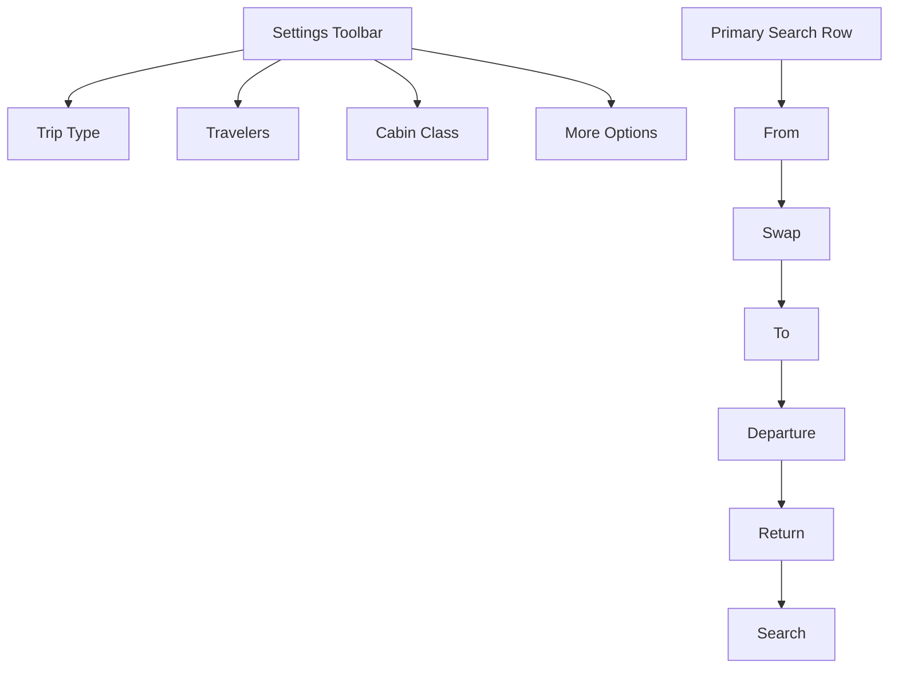
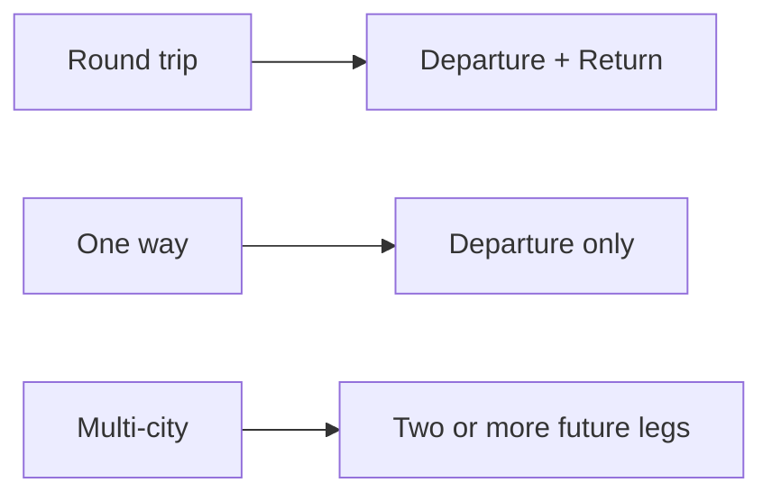
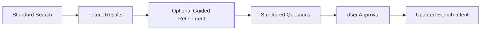

# GTAI V1.2-B — Flight Search Form Blueprint

**Module:** 02 of 07
**Status:** **Approved for documentation. Not approved for functional implementation.**
**Base checkpoint:** `feb07a7283c0951cc64e1a801c71993fcbd2d865`
**Index:** `docs/reference/V1_2_REFERENCE_UX_BLUEPRINT.md`

---

## 1. Purpose

The GTAI flight search form collects the minimum information needed to create a valid **flight-search intent**:

- trip type
- origin
- destination
- travel dates
- travelers
- cabin class
- optional basic preferences

**Core principle:** Fast standard search first · Optional preferences second · AI refinement after search.

The form must remain familiar and fast for ordinary users. It must **not** begin with a long questionnaire, advanced filters or unrestricted AI input.

### 1.1 Form hierarchy

## 2. Trip types

Required: **Round trip · One way · Multi-city**. Default: **Round trip**.

| Trip type  | Required fields                                          |
| ---------- | -------------------------------------------------------- |
| Round trip | From · To · Departure · Return · Travelers · Cabin class |
| One way    | From · To · Departure · Travelers · Cabin class          |

### 2.1 One way — Return removal

For One way, Return must be **removed from the interaction flow**, not merely visually disabled:

- Return must be removed from the interaction flow.
- Return must not remain focusable.
- Screen readers must not announce Return.
- Return must not appear in submitted search intent.

### 2.2 Multi-city — future structure

Documented only. **Not implemented in V1.2-B.**

| Leg      | Fields                |
| -------- | --------------------- |
| Flight 1 | From · To · Departure |
| Flight 2 | From · To · Departure |

Controls: **Add another flight** · **Remove flight**

Future rules:

- minimum 2 legs
- initial maximum 6 legs
- first leg cannot be removed
- every leg requires origin, destination and departure date
- each later leg date must not be before the previous leg date
- **Add another flight** appears after the final leg
- **Remove** appears only from the second leg onward

### 2.3 Trip-type state flow

## 3. Desktop structure

**Settings row:** Trip type · Travelers · Cabin class · Direct flights only · More options

**Main row:** From · Swap · To · Departure · Return · Search

Approximate desktop width priorities:

| Control   | Share |
| --------- | ----- |
| From      | 24%   |
| To        | 24%   |
| Departure | 16%   |
| Return    | 16%   |
| Search    | 20%   |

The form must:

- use horizontal space efficiently
- keep primary controls visually connected
- avoid isolating Cabin class on an empty row
- align the Search CTA with the primary fields
- maintain consistent field heights

## 4. Tablet structure

| Row              | Contents                    |
| ---------------- | --------------------------- |
| Settings toolbar | remains above the main rows |
| First row        | From · Swap · To            |
| Second row       | Departure · Return · Search |

Controlled wrapping is allowed. **No control may be left alone in an otherwise empty row.**

## 5. Mobile structure

Approved order:

1. Trip type
2. From
3. To
4. Departure
5. Return
6. Travelers
7. Cabin class
8. Optional preferences
9. Search

Rules:

- From and To are full width
- Swap remains accessible between origin and destination
- Departure and Return may use two columns when readable
- dates must stack at narrow widths when necessary
- Search is full width
- minimum touch target is 44px
- no page-level horizontal overflow
- visual order and keyboard order must remain consistent

## 6. Trip type selector

A compact segmented control or dropdown. Preferred compact label: **Round trip**.

Options: Round trip · One way · Multi-city

Desktop and mobile may use a compact dropdown to reduce space.

Keyboard behavior:

- Enter or Space opens
- Arrow Up and Arrow Down move between options
- Escape closes
- selecting an option updates the form without page reload
- focus returns to the trigger after selection

## 7. Origin field

|             |                          |
| ----------- | ------------------------ |
| Label       | From                     |
| Placeholder | Country, city or airport |

Selected-airport example:

> Montreal, Canada
> YUL · Montréal–Trudeau

Selected-city example:

> Montreal
> All airports (YMQ)

The future form must store **structured location data**, not display text only.

Future conceptual fields: `type` · `id` · `displayName` · `cityName` · `countryName` · `countryCode` · `iataCode` · `cityCode` · `latitude` · `longitude` · `timeZone`

> **Module 03 — Airport Selector will finalize the location model.** No provider-specific payloads are defined here.

## 8. Destination field

|             |                          |
| ----------- | ------------------------ |
| Label       | To                       |
| Placeholder | Country, city or airport |

Future special option: **Everywhere** — a flexible destination mode, not a normal airport.

When Everywhere is selected in the future:

- dates remain required
- search enters Explore behavior
- destination is recorded as flexible
- it must not be sent to a provider as an airport code

**Do not implement this behavior in V1.2-B.**

## 9. Swap control

**Accessible name:** Swap origin and destination

Future behavior:

- swap origin and destination values
- swap all related metadata
- preserve keyboard focus
- revalidate origin and destination errors
- do not change dates
- do not change travelers
- do not change cabin class

### 9.1 Behavior with one empty field

The control **remains enabled**.

|        | From     | To       |
| ------ | -------- | -------- |
| Before | Montreal | Empty    |
| After  | Empty    | Montreal |

## 10. Departure field

|                  |              |
| ---------------- | ------------ |
| Label            | Departure    |
| Default display  | Add date     |
| Selected example | Tue, Sep 15  |
| Internal value   | `YYYY-MM-DD` |

Display formatting follows locale; internal storage remains an ISO date.

| Locale  | Example display   |
| ------- | ----------------- |
| English | Tue, Sep 15       |
| French  | mar. 15 sept.     |
| Persian | سه‌شنبه ۲۴ شهریور |

## 11. Return field

|                 |          |
| --------------- | -------- |
| Label           | Return   |
| Default display | Add date |

Rules:

- visible only for Round trip
- must not be before Departure
- when Departure becomes later than Return, Return becomes invalid
- **do not silently change Return to another date**
- explain the conflict clearly

Example error:

> Return date must be after departure.

## 12. Flexible dates

Primary Home-level control: **Flexible dates**

Future options: ±1 day · ±2 days · ±3 days · Whole month

Home must not expose multiple detailed flexible-date dropdowns.

> Detailed behavior belongs to **Module 04 — Date Picker and Flexible Dates**.

## 13. Travelers

Examples: `1 adult` · `2 adults, 1 child`

Traveler groups: Adults · Children · Infants in seat · Infants on lap

| Group  | Initial conceptual age range |
| ------ | ---------------------------- |
| Adult  | 16+                          |
| Child  | 2–15                         |
| Infant | under 2                      |

> **Airline and provider age rules may differ and must be revalidated before booking.** These ranges are a GTAI starting point, not an authority.

Rules:

- minimum one Adult
- Infants on lap cannot exceed Adults
- standard search initial maximum: 9 travelers
- larger groups require a separate future flow
- child ages may later be collected individually

The initial search form must **not** collect: full name · date of birth · passport number · gender · nationality · medical information.

## 14. Cabin class

Options: Economy · Premium Economy · Business · First. Default: **Economy**.

For Multi-city:

- one cabin class applies to all legs in the initial product
- per-leg cabin classes are excluded from MVP

## 15. Direct flights only

|         |                     |
| ------- | ------------------- |
| Control | Direct flights only |
| Default | Off                 |

Rules:

- opt-in only
- do not describe direct flights as universally better
- do not remove the restriction automatically when no result is found
- allow the user to remove the restriction explicitly

Future no-result message:

> No direct flights were found for these dates.
> Try including flights with stops.

## 16. Nearby airports

Future options:

- Include nearby airports for origin
- Include nearby airports for destination

These options must not clutter the main Home form. They belong in **More options** or the Airport Selector.

> Detailed behavior belongs to **Module 03**.

## 17. More options

Control label: **More options**

Potential future contents: Direct flights only · Flexible dates · Include nearby origin airports · Include nearby destination airports · Preferred airlines · Excluded airlines · Preferred departure time · Preferred arrival time

**Approved initial Search-form scope:**

- Direct flights only
- Flexible dates
- Nearby airports

Airline and time preferences belong primarily in **Filters** or **AI refinement after search**.

## 18. Search CTA

| Surface                | Label          |
| ---------------------- | -------------- |
| Home                   | Search         |
| Dedicated Flights page | Search flights |

Pre-submit validation:

- origin selected
- destination selected
- origin and destination are different
- Departure selected
- Return selected for Round trip
- Return after Departure
- at least one Adult
- Infants on lap count valid

Future submitting state: **Searching flights…**

During submission:

- prevent duplicate submission
- show a loading indicator
- provide screen-reader status
- preserve the current form values

## 19. Validation strategy

Do **not** show errors on initial focus. Show validation:

- after meaningful blur
- after submit
- immediately when a definite conflict is created

| Condition                   | Message                                   |
| --------------------------- | ----------------------------------------- |
| Origin missing              | Choose where you are flying from.         |
| Destination missing         | Choose where you are flying to.           |
| Same origin and destination | Origin and destination must be different. |
| Departure missing           | Choose a departure date.                  |
| Return missing              | Choose a return date.                     |
| Invalid Return              | Return date must be after departure.      |
| Invalid travelers           | At least one adult is required.           |

Error presentation:

- visible below the field
- **not communicated by red color alone**
- linked with `aria-describedby`
- use an error summary when multiple submit errors exist
- focus management required for the error summary

### 19.1 Error and recovery flow

## 20. GTAI Search Intent state model

Conceptual state — **not** an implementation type:

`tripType` · `origin` · `destination` · `departureDate` · `returnDate` · `travelers` · `cabinClass` · `directOnly` · `flexibleDates` · `nearbyOrigin` · `nearbyDestination`

For Multi-city: `legs[]`

> **The GTAI Search Intent is not a provider payload.** Future Provider Adapters transform the normalized Search Intent into provider-specific requests. No TypeScript interface, database schema or provider payload is defined in this task.

### 20.1 Search Intent lifecycle

> **Provider behavior below is future.** No provider is connected today.

## 21. URL state

After a valid search, non-sensitive values may appear in the URL.

Example:

`/flights?from=YUL&to=IST&depart=2026-09-15&return=2026-09-25&adults=1&cabin=economy`

| Permitted in URL                 | Prohibited in URL                    |
| -------------------------------- | ------------------------------------ |
| location codes                   | full name                            |
| dates                            | passport data                        |
| traveler counts                  | account information                  |
| cabin class                      | full date of birth                   |
| non-sensitive search preferences | visa history                         |
|                                  | health data                          |
|                                  | other sensitive traveler information |

Benefits: browser Back and Forward · shareable search · session restoration · reload without losing search.

## 22. Session restore

Approved future priority:

1. Valid URL parameters
2. Current in-memory session
3. Safe locally saved preference
4. Default values

Rules:

- general search criteria may be stored only under an approved privacy model
- sensitive traveler information must not be stored in Local Storage
- restored state must be validated before use
- invalid restored values must not be submitted silently

## 23. Loading states

During search:

- preserve form values
- Search CTA shows loading
- duplicate submission is prevented
- fields may become temporarily read-only
- screen readers receive status updates

| Stage        | Status text                                              |
| ------------ | -------------------------------------------------------- |
| Primary      | Searching available flight options.                      |
| Long-running | We are comparing available offers from travel providers. |

**Do not show a fabricated provider count.**

## 24. Error states

| Condition                     | Message                                                                              |
| ----------------------------- | ------------------------------------------------------------------------------------ |
| Network error                 | We could not connect. Check your internet connection and try again.                  |
| Provider availability warning | Some travel providers are temporarily unavailable. Available results may be limited. |
| Timeout                       | The search is taking longer than expected. Try again or adjust your search.          |
| Invalid form state            | Some trip details need your attention.                                               |

Rules:

- preserve form data
- provide a clear retry path
- do not clear the form
- **do not claim that every provider responded**
- identify whether results may be incomplete

## 25. Offline state

When offline:

- do not submit
- keep the form editable
- preserve the Search Intent in the current session
- show a clear message

> You appear to be offline.
> Reconnect to search for flights.

## 26. No-result recovery

No Results belongs primarily to the **Results module**. The search form must support future recovery actions:

- Change dates
- Include nearby airports
- Remove direct-only restriction
- Search other destinations
- Start guided AI refinement

Future AI prompt:

> Would you like GTAI to suggest more flexible options?

**AI must not modify user constraints without explicit approval.**

## 27. AI integration points

AI must **not** replace the standard search form.

| Moment                         | Future entry point                          |
| ------------------------------ | ------------------------------------------- |
| After limited or failed search | Find more options with guided planning      |
| After results                  | Refine these results with 5 quick questions |

Complex-trip indicators may include: children · older travelers · complex stops · transit visa concerns · limited budget · flexible dates.

Rules:

- AI remains optional
- AI must not block standard search
- no automatic setting changes
- no unrestricted free-text planning as the primary mechanism

### 27.1 AI refinement flow

> **AI behavior below is future.** No agent, model or refinement engine exists today.

## 28. Accessibility

Requirements:

- real form element
- appropriate fieldset and legend for trip type
- real labels
- `aria-describedby` for errors and help text
- focusable error summary
- Enter submits when valid
- Escape closes active popup
- focus returns to trigger after popup closure
- Swap has an accessible name
- loading announced through `aria-live`
- correct distinction between disabled and read-only
- logical tab order
- visible focus
- minimum 44px touch targets
- reduced-motion support
- no inaccessible icon-only control

Suggested desktop keyboard order:

| #   | Control      |
| --- | ------------ |
| 1   | Trip type    |
| 2   | Travelers    |
| 3   | Cabin class  |
| 4   | More options |
| 5   | From         |
| 6   | Swap         |
| 7   | To           |
| 8   | Departure    |
| 9   | Return       |
| 10  | Search       |

**Mobile keyboard order must match visual order.**

## 29. RTL behavior

For Persian and Arabic:

- origin begins at the logical inline start
- destination follows origin
- Swap remains conceptually between them
- Departure and Return meaning remains unchanged
- only semantically directional icons are mirrored
- IATA codes use LTR isolation
- numeric and currency data remain readable
- use logical CSS properties

> Calendar behavior is deferred to **Module 04**.

## 30. Responsive acceptance

| Width  | Expectations                                                                                                          | RTL implications                                                                              |
| ------ | --------------------------------------------------------------------------------------------------------------------- | --------------------------------------------------------------------------------------------- |
| 360px  | No page overflow · search tabs do not wrap · Search full width · dates stack when necessary · labels remain visible   | Field order mirrors; tab row scrolls from the inline start; Search still spans full width     |
| 390px  | Readable form · 44px touch targets · accessible Swap · secondary settings collapsed when needed                       | Swap stays between the mirrored From/To pair; collapsed settings open toward the inline start |
| 768px  | From and To in the first row · dates and Search in the second row · Travelers and Cabin class in the settings toolbar | Both rows mirror as units; Search sits at the inline end of the second row                    |
| 1024px | One or two balanced rows · no isolated single field                                                                   | Row composition mirrors without re-ordering meaning                                           |
| 1280px | Primary fields in one row · clear Search CTA · compact toolbar · no unnecessary empty space                           | Search lands at the inline end; toolbar mirrors                                               |
| 1440px | Primary fields in one row · clear Search CTA · compact toolbar · no unnecessary empty space                           | As 1280px, with the wider container mirrored                                                  |

## 31. Future analytics events

Documented only:

`flight_form_viewed` · `trip_type_changed` · `origin_field_opened` · `destination_field_opened` · `origin_selected` · `destination_selected` · `locations_swapped` · `departure_opened` · `return_opened` · `travelers_opened` · `cabin_class_changed` · `direct_only_toggled` · `flexible_dates_toggled` · `flight_search_submitted` · `flight_search_validation_failed` · `flight_search_retry_selected` · `guided_refinement_selected`

Rules:

- **no analytics is active in V1.2-B**
- Airport search text requires privacy review
- do not record sensitive traveler details
- analytics requires consent and governance approval

## 32. Security and privacy

The flight search form must **not**:

- collect passport data
- require nationality for standard flight search
- collect visa history
- collect medical information
- secretly distribute the search query to uncontrolled services
- expose API keys in the client
- trust raw provider responses directly
- render external HTML
- silently persist sensitive data

Future provider searches must pass through a **controlled GTAI backend and normalized adapter layer**.

## 33. Module boundaries

**Module 03 — Airport Selector** will define: suggestions · city and airport grouping · IATA behavior · nearby airports · recent searches · location permission · no-result behavior · keyboard navigation.

**Module 04 — Date Picker and Flexible Dates** will define: calendar · round-trip selection · flexible dates · month views · price indicators · locale formatting · RTL · minimum and maximum dates · date validation.

> **Module 02 must not invent popup-specific details reserved for Modules 03 and 04.**

## 34. Explicit exclusions

V1.2-B does **not** implement:

airport autocomplete · airport dataset · calendar · live prices · flight API · provider adapter · search results · functional Multi-city · functional traveler popup · affiliate links · authentication · database · AI questionnaire · analytics · geolocation · price tracking · booking · payment

## 35. Acceptance criteria

The blueprint is complete only when it defines:

| #   | Requirement                                    | Section     |
| --- | ---------------------------------------------- | ----------- |
| 1   | Trip-type behavior                             | 2           |
| 2   | Round trip and One way differences             | 2, 2.1      |
| 3   | Future Multi-city rules                        | 2.2         |
| 4   | Exact control order                            | 3, 4, 5, 28 |
| 5   | Structured origin and destination requirements | 7, 8        |
| 6   | Swap behavior                                  | 9           |
| 7   | Date rules                                     | 10, 11, 12  |
| 8   | Traveler rules                                 | 13          |
| 9   | Cabin-class rules                              | 14          |
| 10  | Direct flights and Flexible dates placement    | 15, 12, 17  |
| 11  | Search CTA behavior                            | 18          |
| 12  | Validation                                     | 19          |
| 13  | URL state                                      | 21          |
| 14  | Session restore                                | 22          |
| 15  | Loading                                        | 23          |
| 16  | Offline behavior                               | 25          |
| 17  | Error handling                                 | 24          |
| 18  | No-result recovery                             | 26          |
| 19  | AI entry points                                | 27          |
| 20  | Desktop behavior                               | 3, 30       |
| 21  | Tablet behavior                                | 4, 30       |
| 22  | Mobile behavior                                | 5, 30       |
| 23  | RTL behavior                                   | 29, 30      |
| 24  | Accessibility                                  | 28          |
| 25  | Sensitive-data exclusions                      | 13, 21, 32  |
| 26  | Module 03 and Module 04 boundaries             | 33          |
| 27  | Prohibition on implementation before approval  | 37          |

> **Future implementation agents may not change the Flight Search Form structure, state model or validation behavior without an approved blueprint revision.**

## 36. Final product decision

> The GTAI Flight Search Form must remain fast and familiar for standard users while producing a normalized GTAI Search Intent that future provider adapters and specialized AI agents can consume independently of the user interface.
>
> AI refines the search after or around the standard flow. It does not replace the standard flight-search form.

## 37. Implementation prohibition

> **This blueprint authorizes documentation only. It does not authorize implementation of Airport Selector, Date Picker, Travelers Selector, Multi-city legs, Flight Search API, provider integration, Results, affiliate redirect, booking, payment, analytics or production AI.**

---

## Open questions

Genuinely unresolved items only.

| #   | Question                                                             | Blocks                       |
| --- | -------------------------------------------------------------------- | ---------------------------- |
| 1   | Final airline/provider age rules for traveler categories             | Traveler validation          |
| 2   | Final maximum traveler count supported by each provider              | Traveler limits              |
| 3   | Final Multi-city leg maximum after provider review                   | Multi-city implementation    |
| 4   | Whether Trip Type uses a dropdown or segmented control in production | Trip-type implementation     |
| 5   | Final URL parameter names                                            | URL state implementation     |
| 6   | Approved privacy model for safe search-state persistence             | Session restore              |
| 7   | Final analytics and consent platform                                 | Any analytics implementation |

---

## V2.8-B — the Flight Search API is unchanged

The internal wire contract in `features/flights/flight-search-api-contract.ts`
is untouched by V2.8-B: same version, same path, same request shape, same
narrow response envelope.

What V2.8-B adds is a **server-side** neutral search shape
(`ExternalNeutralSearch`) that widens a validated `FlightSearchIntent` into a
form a live provider could be asked in — including multi-city, which the
product's own intent deliberately does not model. The widening is one-way:
nothing narrows back, so a three-leg search can never be smuggled into a
two-leg product type.

That shape never crosses the wire. The browser continues to send a validated
Search Intent and receive normalized offers, and the client-safe contract still
declares no credential-bearing field — asserted by
`verify:provider-integration-readiness`.
