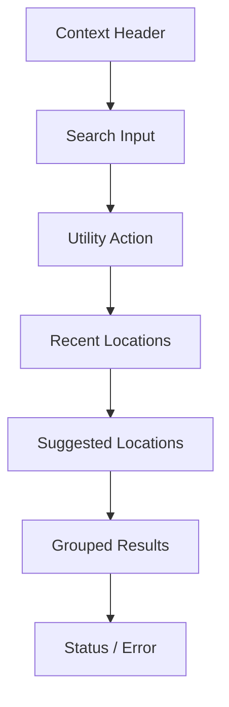
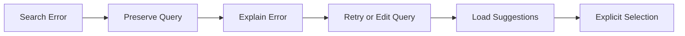
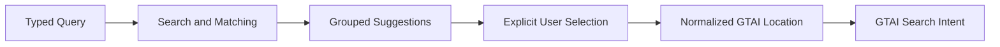
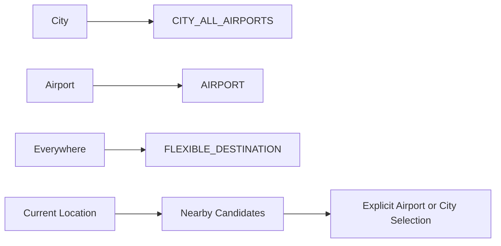
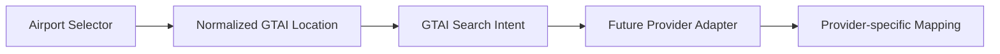

# GTAI V1.2-C — Airport Selector Blueprint

**Module:** 03 of 07
**Status:** **Approved for documentation. Not approved for functional implementation.**
**Base checkpoint:** `87a00a84b9e75fbf30b99e2ee210c2d3f17f7c7d`
**Index:** `docs/reference/V1_2_REFERENCE_UX_BLUEPRINT.md`

> **Implementation note — V2.1.** This blueprint has since been implemented, in
> part, by **V2.1 — Functional Airport Selector**. Sections 1–18, 23–24, 30–48
> and 55–59 are built and verified against a **demonstration directory** of 15
> cities and 21 airports. Still unimplemented and unchanged in status:
> **§20–§22** (nearby airports), **§26–§29** (current location and geolocation
> permission), **§49–§50** (production dataset and freshness) and the
> analytics of §54. Recent locations (§24–§25) are session-scoped only. See
> `docs/implementation/V2_1_FUNCTIONAL_AIRPORT_SELECTOR.md`. The prohibition in
> §62 continues to apply to everything listed there as unimplemented.

---

## 1. Purpose

The Airport Selector must allow users to find and explicitly select a valid flight-search location through:

- city name
- airport name
- IATA code
- country name
- local-language name
- English name
- verified aliases
- common spellings

Examples: Montreal · Montréal · YUL · Trudeau · Canada · Tehran · تهران · IKA · Mehrabad · مهرآباد

**Core principle:** Search broadly. Understand the entity. Select explicitly. Store a normalized location.

The Selector must clearly distinguish: city · all airports in a city · individual airport · nearby airport · flexible destination.

### 1.1 Selector information hierarchy

## 2. Entry points

The Selector may open from: From · To · future Multi-city origin fields · future Multi-city destination fields · future Explore origin field.

Base behavior is shared across contexts. Context-specific rules:

- **Everywhere** appears only for destination.
- **Use current location** is primarily an origin action.
- recent origins and recent destinations may receive different contextual ranking.
- the current context must be announced accessibly.

## 3. Origin and destination differences

| Context     | May contain                                                                                   | Must not contain |
| ----------- | --------------------------------------------------------------------------------------------- | ---------------- |
| Origin      | Recent origins · Use current location · Nearby airports · Cities · Individual airports        | Everywhere       |
| Destination | Recent destinations · Everywhere · Cities · Individual airports · Nearby destination airports | —                |

## 4. Desktop presentation

- anchored Popover or Combobox panel
- placed directly below the associated field when space permits
- minimum width approximately 360px
- preferred width approximately 440–520px
- maximum height approximately 520px
- may be wider than the triggering field
- internal result scrolling
- must remain visually attached to the field
- must remain inside the viewport
- may open upward when insufficient space exists below
- closes on outside interaction
- closes with Escape

> Dimensions are initial design targets and must be validated during implementation against translations and viewport constraints.

## 5. Mobile presentation

At 360px and 390px:

- use a large Bottom Sheet or Full-screen Sheet
- search input remains visible near the top
- results scroll independently
- clear Close control required
- title indicates origin or destination context

Suggested titles: **Choose your origin** · **Choose your destination**

Rules:

- respect device safe areas
- do not hide behind the global header
- mobile keyboard must not obscure active results
- after selection, close the Sheet
- return focus logically to the form
- focus must remain trapped inside the Sheet while open

> The final choice between Bottom Sheet and Full-screen Sheet remains an open question.

## 6. Selector hierarchy

Approved hierarchy:

1. Context header
2. Search input
3. Optional utility action
4. Recent locations
5. Suggested locations
6. Search results
7. Status, empty or error message

Possible empty-query content: Use current location · Recent searches · Popular airports · Everywhere.

**Do not display every optional block simultaneously without prioritization.**

## 7. Search input

|                  |                              |
| ---------------- | ---------------------------- |
| Accessible label | Search for a city or airport |
| Placeholder      | City, airport or IATA code   |

Rules:

- placeholder must not replace the real label
- prevent personal-address browser autocomplete where appropriate
- typed query and selected entity are separate states
- raw typed text must never automatically become a valid location
- input remains editable during loading
- input length must be constrained safely
- search must support clear and reset behavior

## 8. Initial and active search behavior

| Stage                  | Behavior                                                                                                                                                                                       |
| ---------------------- | ---------------------------------------------------------------------------------------------------------------------------------------------------------------------------------------------- |
| Before typing          | show Recent locations if available · show Use current location for origin where appropriate · show Everywhere for destination · show restrained suggested locations when no recent data exists |
| After meaningful input | begin matching · trim surrounding whitespace · match without case sensitivity · normalize common accent differences · preserve the typed query · remove irrelevant empty-state content         |

Treated as equivalent for matching: `Montreal` · `Montréal` · `MONTREAL`

## 9. Query threshold and debounce

- valid three-letter IATA queries may be searched immediately
- city or airport names may begin matching from one meaningful character
- one-character generic queries must return limited, conservative results
- future remote search must use debounce
- **uncontrolled network requests on every keystroke are prohibited**

Initial debounce analysis range: **150–250 ms**. The exact value remains an implementation decision based on real latency and usability measurements.

## 10. Languages, local names and aliases

Future search should support: English names · local names · translated names · accent-insensitive names · verified common aliases · verified historical or alternate names · IATA codes · city codes · controlled transliteration.

Examples: Tehran · تهران · IKA · Mehrabad · مهرآباد

Rules:

- location data must come from a validated location dataset
- **UI translation dictionaries are not the location-data source**
- original and local names may be displayed together
- transliteration must not fabricate locations
- aliases require source governance

## 11. Entity types

Primary conceptual entity types:

- `CITY`
- `CITY_ALL_AIRPORTS`
- `AIRPORT`
- `FLEXIBLE_DESTINATION`
- `CURRENT_LOCATION_RESOLUTION`

A country may exist as a searchable dataset entity, but **a country alone is not a standard selectable airport location**.

No TypeScript enums or implementation code are defined here.

## 12. Country search

Users may search country names such as Canada · France · Japan.

**The country itself must not be presented as a normal selectable airport.** Instead, show relevant major cities, important airports, and the exact country-name match as context.

Example structure:

> **Canada**
>
> Cities: Toronto · Montreal · Vancouver
>
> Airports: Toronto Pearson — YYZ · Montréal–Trudeau — YUL · Vancouver International — YVR

Country-level destination selection may be considered later **only for Explore Mode**.

## 13. City result

Example:

> Montreal, Canada
> All airports · YMQ

Display: city name · country · All airports label · valid city code when available · airport count only when useful and reliable.

Selecting a city:

- stores `CITY_ALL_AIRPORTS`
- retains member-airport relationships
- does not assume the city code is accepted by every provider
- creates a normalized location, **not a provider payload**

## 14. Airport result

Example:

> Montréal–Trudeau International Airport
> YUL · Montreal, Canada

Display: validated official or short airport name · IATA code · city · country · entity type through visual and textual context · optional distance only when accurately available.

**IATA codes must use LTR isolation.**

## 15. Result grouping

Suggested result groups:

1. Best match
2. Cities and all airports
3. Airports
4. Nearby airports
5. Other matches

Rules:

- render only groups containing results
- do not render empty headings
- exact IATA match belongs at the top
- grouping must remain understandable to screen readers
- grouping must not create duplicate selectable entities

## 16. Result ranking

Suggested ranking priority:

| #   | Signal                             |
| --- | ---------------------------------- |
| 1   | exact IATA match                   |
| 2   | exact city-code match              |
| 3   | exact city-name match              |
| 4   | exact airport-name match           |
| 5   | name starts with query             |
| 6   | verified alias or transliteration  |
| 7   | partial match                      |
| 8   | transport importance or popularity |
| 9   | recent selection                   |
| 10  | origin or destination context      |

Rules:

- **affiliate commission must not secretly affect ranking**
- commercial relationships must not override relevance
- ranking must be auditable
- rank score must not be shown as a fabricated user-facing score
- the final algorithm remains an open question

## 17. Exact IATA match

Examples: YUL · IST · IKA

Rules:

- exact valid IATA match appears first
- **do not auto-select**
- require explicit Enter or pointer selection
- show alternatives when ambiguous
- invalid three-letter input remains a query, not a location
- selection creates an `AIRPORT` entity

## 18. All airports

Examples: London — All airports · New York — All airports · Paris — All airports

For a general city query, City All Airports should appear **before** its individual airports:

> London, United Kingdom — All airports · LON
> Heathrow Airport — LHR · London
> Gatwick Airport — LGW · London
> London City Airport — LCY · London

A specific exact airport query may rank the individual airport above the City group.

## 19. Provider compatibility

All-airports support differs between providers.

Rules:

- UI must not assume every provider accepts a city code
- GTAI Search Intent preserves the City entity and member airports
- the future Provider Adapter chooses among: city code · airport list · multiple requests · unsupported state
- **provider mapping must not occur inside Airport Selector**
- no provider-specific code is stored as the primary location identity

## 20. Nearby airport concepts

Two distinct concepts:

1. airports near a selected city
2. airports near the user's current location

Rules:

- nearby origin and nearby destination are separate preferences
- activation requires user choice
- changing search scope must be visible
- **no hidden radius expansion**
- provider compatibility is handled later
- nearby must not silently replace the selected location

## 21. Nearby-airport presentation

Possible controls: **Include nearby airports** · **Also search airports near Montreal**

Preferred placement: inside Airport Selector, or More options.

**Do not add a large primary-form control.** The user must understand whether Nearby is active.

## 22. Nearby definition

Potential future approaches: geographic distance · estimated driving time · metropolitan area · provider-supported airport group · transport connectivity.

Rules:

- do not assume one fixed global radius
- different regions require different interpretations
- exact policy remains open
- this module documents the concept only

## 23. Everywhere

Everywhere is **destination-only**. Entity type: `FLEXIBLE_DESTINATION`.

Display:

> Everywhere
> Explore destinations within your budget

Rules:

- never appears for origin
- has no airport code
- is not sent as a normal provider airport
- activates a future Explore flow
- requires travel dates or a travel period
- must not fabricate standard flight-search results

## 24. Recent locations

Recent locations may contain City · All airports · Airport.

Initial recommendation: **maximum 5 recent locations per context**.

Rules:

- no duplicates
- newest selection first
- user can clear history
- empty query may display recent locations
- active query should prioritize current matching over recency
- origins and destinations may have separate context weighting

## 25. Recent-location storage

| Potentially permitted | Must not be stored                      |
| --------------------- | --------------------------------------- |
| entity ID             | exact current-location coordinates      |
| entity type           | long raw queries                        |
| display name          | IP address                              |
| IATA or city code     | passport data                           |
| approximate timestamp | sensitive traveler information          |
|                       | complete travel history without consent |

Retention policy remains open and belongs to an approved privacy model.

## 26. Current location

Control: **Use current location**

Rules:

- activates only after explicit user action
- **do not request permission automatically on Selector open**
- explain the purpose before requesting permission
- do not permanently store exact coordinates
- current coordinates are not the final selected origin
- the user must explicitly select a resolved Airport or City

## 27. Location-permission flow

> **Future behaviour.** No geolocation, permission prompt or resolution service exists today.

1. User selects **Use current location**.
2. GTAI explains the purpose.
3. Browser permission is requested.
4. If allowed, coordinates are sent to a controlled nearby-airport resolution service.
5. Nearby location candidates are displayed.
6. User explicitly selects one candidate.

## 28. Permission denied

> Location access was not allowed.
> Search for a city or airport instead.

Rules:

- keep Selector open
- keep manual search available
- do not repeatedly prompt
- do not block flight search
- future browser-setting guidance may be provided separately
- do not show technical browser errors

## 29. Location unavailable

> We could not determine your location.
> Search for a city or airport instead.

Possible internal causes: unsupported device · timeout · browser error · insufficient accuracy · resolution-service failure.

**Do not expose raw technical details.**

## 30. Result-row design

Every result row must:

- be at least 44px high
- have a fully selectable row
- distinguish entity type
- contain primary and secondary text
- have visible focus and hover states
- support keyboard selection
- avoid false clickable sub-elements

Airport example:

> [Airport icon] Montréal–Trudeau International Airport
> YUL · Montreal, Canada

City example:

> [City icon] Montreal, Canada
> All airports · YMQ

## 31. Icon rules

Allowed semantic icons: City · Airport · Current location · Recent · Everywhere.

Rules:

- **icon cannot be the only source of meaning**
- include textual context
- do not use airline logos
- do not use provider logos
- directional icons mirror only when semantically appropriate
- use original or properly licensed iconography

## 32. Selection behavior

After selection:

- store the complete normalized entity
- update the field display
- close the Selector
- announce successful selection
- move focus logically

Suggested future flow: after From selection, focus To · after To selection, focus Departure.

Rules:

- focus movement must remain predictable
- mobile must avoid disruptive keyboard or viewport jumps
- screen-reader users must receive clear context
- **no automatic form submission**

## 33. Typed query vs selected entity

> **Core rule: a typed query is not a selected location.**

If text exists without an explicit selected result:

- location remains invalid
- submit validation must fail
- typed text may remain for correction
- **do not auto-select the first result**

Error:

> Choose a city or airport from the suggestions.

## 34. Editing after selection

If a user edits the text after selecting a location:

- invalidate the prior entity
- clear stale metadata
- enter query mode
- require a new explicit selection
- prohibit submission using the old airport code

This prevents mismatched display text and submission data.

## 35. Clear control

Accessible labels: **Clear origin** · **Clear destination**

After Clear:

- remove query
- remove selected entity
- remove associated metadata
- update validation state appropriately
- retain focus in the input

## 36. Keyboard navigation

Use an accessible Combobox pattern.

| Key         | Action               |
| ----------- | -------------------- |
| Arrow Down  | next result          |
| Arrow Up    | previous result      |
| Home        | first result         |
| End         | last result          |
| Enter       | select active result |
| Escape      | close                |
| Tab         | leave naturally      |
| Shift + Tab | move backward        |

Rules:

- focus may remain on the input
- active result managed with `aria-activedescendant`
- active result must remain visible during scrolling
- **Enter without an active result must not create a location**
- keyboard navigation must cross group boundaries predictably

## 37. Screen-reader behavior

Announce: input purpose · origin or destination context · result count · current group · active result · entity type · IATA code · successful selection · loading · no results · errors.

Example:

> 5 results available.
> Montréal–Trudeau International Airport, YUL, Montreal, Canada, airport, 1 of 5.

Avoid excessively repeated announcements on every keystroke.

## 38. Focus management

| Moment          | Behavior                                                       |
| --------------- | -------------------------------------------------------------- |
| On open         | focus remains in or moves to the Search input                  |
| On selection    | focus moves to the next logical form control                   |
| On Escape       | Selector closes; focus returns to the trigger or input         |
| On error        | do not remove focus without reason                             |
| On Mobile Sheet | trap focus inside; restore focus to the opening field on close |

## 39. Loading state

> Searching cities and airports…

Rules:

- preserve query
- show restrained progress indication
- announce loading accessibly
- keep input editable
- **prevent old requests from overwriting newer query results**
- cancel or ignore stale requests
- do not show fabricated results

## 40. Empty state

With focus and no query, contextual options may include Recent locations · Use current location · Popular airports · Everywhere.

Rules:

- respect origin or destination context
- do not show fake prices
- **do not show paid placement disguised as relevance**
- do not overwhelm the user with every optional block

## 41. No results

> No cities or airports found.
> Check the spelling or try an IATA code.

Recovery: edit query · try English or local name · enter IATA code · clear search · search a nearby city.

**Do not create or suggest fabricated airports.**

## 42. Ambiguous results

Examples: Springfield · London · San José

Rules:

- clearly show country and region
- show IATA codes where applicable
- do not remove alternatives solely because of popularity
- do not auto-select
- display enough context for an informed choice

## 43. Error state

> We could not load airport suggestions.
> Try again.

Rules:

- preserve query
- show Retry
- keep Selector open
- do not clear the form
- do not show raw technical errors
- **distinguish error from No results**

### 43.1 Error and recovery flow

## 44. Offline state

If a validated local dataset is available: limited cached search may continue, and it must clearly state that results may be limited.

If unavailable:

> You appear to be offline.
> Reconnect to search for cities and airports.

Rules:

- **do not present stale results as current**
- retain the typed query
- allow retry after reconnection

## 45. Result limits

Initial recommendation:

- 8–12 initial results
- internal scrolling for more
- no traditional pagination inside the Combobox
- virtualization only when justified

Rules:

- limit by relevance quality
- **do not simply show the first dataset records**
- exact and high-confidence matches remain visible
- the final result count remains open

## 46. Normalized location model

Conceptual fields: `id` · `entityType` · `displayName` · `localizedNames` · `cityName` · `cityCode` · `countryName` · `countryCode` · `regionName` · `iataCode` · `airportCodes` · `latitude` · `longitude` · `timeZone` · `isAllAirports` · `isFlexibleDestination` · `source` · `sourceVersion`

Potential search fields: `aliases` · `searchTokens` · `normalizedName` · `popularityRank`

Rules:

- conceptual model only
- no TypeScript interface
- no database schema
- no provider payload
- exact field requirements may be refined after dataset selection

## 47. Selected location state

Minimum conceptual selected state: `entityId` · `entityType` · `displayLabel` · `cityCode` · `iataCode` · `countryCode` · `airportCodes` · `latitude` · `longitude` · `timeZone`

Rules:

- display state and submission state remain separate
- UI does not display all internal metadata
- stale metadata must be cleared when editing
- selected state feeds the normalized GTAI Search Intent

### 47.1 Entity-selection lifecycle

### 47.2 Location entity flow

> **Current Location behaviour is future.** No geolocation exists today.

## 48. Search-result metadata

Potential internal metadata: `matchType` · `matchedField` · `rankScore` · `isRecent` · `isPopular` · `distanceFromUser`

Rules:

- do not send ranking metadata to providers as location data
- **do not display `rankScore` as a user-facing truth score**
- affiliate data must not secretly influence relevance
- distance requires validated location permission and calculation

## 49. Dataset requirements

The future dataset must:

- use an authorized and credible source
- be versioned
- manage closed airports
- manage renamed airports
- manage changed codes
- manage commercial-service status
- include valid IATA codes
- model City–Airport relationships
- include country
- include time zone
- support local names
- support verified aliases
- record update date

**Unauthorized scraping is prohibited.**

## 50. Data freshness

Potential changes: airport opening · airport closure · airport renaming · code changes · commercial-service changes · City group changes.

Requirements: version control · update policy · validation before production deployment · rollback capability · source traceability.

**Do not ship uncontrolled stale data.**

## 51. Provider independence

Airport Selector must not be based on one provider's proprietary model.

> **Provider behaviour is future.** No provider is connected today.

Rules:

- the normalized entity remains provider-independent
- provider mapping occurs later
- no provider-specific location ID as primary identity
- **no provider API call from the Selector UI**

## 52. Privacy

Airport search can reveal travel patterns.

Rules:

- raw queries require privacy review before storage
- recent locations require an approved retention policy
- current location requires explicit consent
- **do not permanently store exact coordinates**
- do not use location history for hidden advertising
- provide future history-clearing controls
- collect only data necessary for the selected feature

## 53. Security

Future requirements:

- normalize input
- validate input
- sanitize external text
- **never render external HTML**
- rate-limit backend search
- cap query length
- cancel or ignore stale requests
- keep API keys server-side
- use a controlled backend data source
- validate dataset records
- reject malformed location entities

## 54. Future analytics

Documented only:

`airport_selector_opened` · `airport_query_started` · `airport_result_viewed` · `airport_result_selected` · `city_all_airports_selected` · `airport_exact_iata_selected` · `airport_query_no_results` · `airport_selector_error` · `airport_selector_closed` · `recent_location_selected` · `recent_locations_cleared` · `current_location_requested` · `current_location_allowed` · `current_location_denied` · `nearby_airport_selected` · `everywhere_selected`

Rules:

- **analytics is inactive in V1.2-C**
- do not record raw queries before privacy review
- do not record exact coordinates
- consent and governance approval are required
- do not record sensitive traveler information

## 55. RTL behavior

For Persian and Arabic:

- city and country text use appropriate RTL direction
- IATA codes use LTR isolation
- **YUL, IKA and IST must not reverse**
- icon uses logical inline-start
- mixed-direction secondary text remains readable
- list order preserves semantic ranking
- only semantically directional icons mirror
- Popover positioning uses logical properties
- focus and keyboard behavior remain identical

## 56. Responsive acceptance

| Width  | Expectations                                                                                                                                                     | RTL implications                                                                               |
| ------ | ---------------------------------------------------------------------------------------------------------------------------------------------------------------- | ---------------------------------------------------------------------------------------------- |
| 360px  | Full-screen or large Bottom Sheet · fixed visible search input · minimum 44px result rows · no horizontal overflow · readable IATA codes · visible Close control | Sheet header and Close mirror; row icons sit at the inline start; IATA codes stay LTR-isolated |
| 390px  | Usable with mobile keyboard open · compact Recent and Current Location areas · clear groups · safe-area support                                                  | Group headings align to the inline start; utility actions mirror with the sheet                |
| 768px  | Large Popover or appropriately sized Sheet · sufficient width · internal scrolling · no viewport clipping                                                        | Popover anchors from the logical inline start of its field                                     |
| 1024px | Anchored Popover · controlled maximum height · viewport-aware placement                                                                                          | Anchor and overflow flip logically; upward opening behaves identically                         |
| 1280px | Precisely anchored panel · clear grouping · no unnecessary empty space · readable multilingual content                                                           | Mirrored anchoring; secondary metadata line stays readable in mixed direction                  |
| 1440px | Precisely anchored panel · clear grouping · no unnecessary empty space · readable multilingual content                                                           | As 1280px within the wider mirrored container                                                  |

## 57. Boundary with Flight Search Form

| V1.2-B owns                 | V1.2-C owns                                                                                                                                            |
| --------------------------- | ------------------------------------------------------------------------------------------------------------------------------------------------------ |
| From and To field placement | location query                                                                                                                                         |
| general form validation     | suggestions                                                                                                                                            |
| normalized Search Intent    | City and Airport distinction                                                                                                                           |
| form submission             | All airports · Nearby airports · Recent locations · Current location · Everywhere · explicit entity selection · keyboard and screen-reader interaction |

**Airport Selector must not submit the flight-search form.**

## 58. Boundary with Date Picker

Airport Selector must not: alter dates · open the Calendar · interpret flexible-date settings · validate date ranges.

After destination selection, it may only move focus to Departure.

**All Calendar behavior belongs to V1.2-D.**

## 59. Boundary with Provider Adapter

Airport Selector must not: generate provider-specific codes · call provider APIs · assume universal city-code support · store provider-specific Airport groups as primary entities · apply affiliate ranking · create provider payloads.

The future Provider Adapter owns mapping and compatibility.

## 60. Explicit exclusions

V1.2-C does **not** implement:

production airport dataset · autocomplete API · search index · real geolocation · nearby-airport resolution · provider mapping · provider API · live availability · live pricing · real popularity ranking · recent-location storage · analytics · database · authentication · map · distance calculation · affiliate ranking · airport images

## 61. Open questions

| #   | Question                                          | Blocks                 |
| --- | ------------------------------------------------- | ---------------------- |
| 1   | Final airport-dataset source                      | Dataset acquisition    |
| 2   | Local index versus backend search                 | Search architecture    |
| 3   | Dataset update and versioning policy              | Data freshness         |
| 4   | Final initial-result count                        | Result limits          |
| 5   | Recent Locations retention policy                 | Privacy model          |
| 6   | Final ranking algorithm                           | Ranking implementation |
| 7   | Final regional definition of Nearby               | Nearby airports        |
| 8   | Final geolocation service                         | Current location       |
| 9   | Country behavior in Explore Mode                  | Explore module         |
| 10  | Multi-airport City mapping strategy for providers | Provider Adapter       |
| 11  | Bottom Sheet versus Full-screen Sheet on mobile   | Mobile presentation    |

## 62. Acceptance criteria and final decision

The blueprint is complete only when it defines:

| #   | Requirement                        | Section        |
| --- | ---------------------------------- | -------------- |
| 1   | Accepted query types               | 1, 10          |
| 2   | City and Airport distinction       | 11, 13, 14     |
| 3   | All airports                       | 18, 19         |
| 4   | Country search                     | 12             |
| 5   | Everywhere                         | 23             |
| 6   | Recent locations                   | 24, 25         |
| 7   | Current-location permission        | 26, 27, 28, 29 |
| 8   | Nearby airports                    | 20, 21, 22     |
| 9   | Grouping                           | 15             |
| 10  | Ranking                            | 16             |
| 11  | Explicit selection                 | 17, 32, 33     |
| 12  | Typed query versus selected entity | 33             |
| 13  | Editing and clearing               | 34, 35         |
| 14  | Keyboard interaction               | 36             |
| 15  | Screen-reader behavior             | 37             |
| 16  | Focus management                   | 38             |
| 17  | Loading                            | 39             |
| 18  | Empty state                        | 40             |
| 19  | No results                         | 41             |
| 20  | Ambiguous results                  | 42             |
| 21  | Error                              | 43             |
| 22  | Offline behavior                   | 44             |
| 23  | Desktop Popover                    | 4              |
| 24  | Mobile Sheet                       | 5              |
| 25  | RTL behavior                       | 55, 56         |
| 26  | Normalized location data           | 46             |
| 27  | Selected-location state            | 47             |
| 28  | Dataset requirements               | 49             |
| 29  | Data freshness                     | 50             |
| 30  | Privacy                            | 52             |
| 31  | Security                           | 53             |
| 32  | Provider independence              | 51, 59         |
| 33  | Boundaries with Search Form        | 57             |
| 34  | Boundaries with Date Picker        | 58             |
| 35  | Boundaries with Provider Adapter   | 59             |
| 36  | Implementation exclusions          | 60             |

### Final product decision

> The Airport Selector must remain simple and familiar for users while creating a normalized GTAI Location Entity for the GTAI Search Intent.
>
> A user must explicitly select a City, All-airports group, individual Airport or Flexible Destination. **Typed text alone is not a valid selected location.**
>
> Provider relationships, affiliate commission and commercial placement must not secretly affect Airport Selector ranking.

### Implementation prohibition

> **This blueprint authorizes documentation only. It does not authorize implementation of an Airport Dataset, Autocomplete API, Search Index, Geolocation, Nearby Airport Resolution, Recent Location Storage, Provider Mapping, Analytics or production Airport Selector UI.**
>
> **Future implementation agents may not change the entity model, explicit-selection rule, ranking principles or module boundaries without an approved blueprint revision.**
