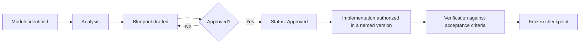

# GTAI V1.2 — Reference UX Blueprint

Master index for the GTAI V1.2 blueprint programme.

**Version status:** In progress · documentation only
**Base checkpoint:** `f5f6d8c2dda05919188f4bc1714559c690197c28` (V1.1 — Homepage Metasearch Alignment)

---

## 1. Purpose

V1.2 exists to remove implementation ambiguity.

Every earlier version required an implementer to make product decisions mid-task. That is where scope drift, invented features and inconsistent interaction design come from. V1.2 moves those decisions **before** implementation, into approved blueprints that later versions follow literally.

A blueprint in this programme is not a suggestion. It is the specification an implementation agent is bound by.

**Implementation agents must not redesign, reinterpret, simplify, expand or invent product decisions beyond an approved blueprint.** Where a blueprint is silent, the correct action is to raise an open question — not to decide.

## 2. Scope

V1.2 produces **documentation only**. It changes no application code, no dependency, no configuration and no asset.

In scope:

- the seven blueprint modules listed in section 5
- global UX, accessibility, responsive, RTL, affiliate-disclosure and AI-entry principles that apply across all modules
- the documentation template every module must satisfy
- the approval workflow

Out of scope: see section 14.

## 3. Reference-product policy

GTAI studies established travel products to understand **what travellers already expect**. References inform structure and vocabulary. They are never a source of implementation.

| Reference                                                           | Used for                                                                                                                  | Not used for                          |
| ------------------------------------------------------------------- | ------------------------------------------------------------------------------------------------------------------------- | ------------------------------------- |
| Skyscanner-style global travel metasearch                           | structural clarity, information architecture, product-tab pattern, search control hierarchy, result organization concepts | anything visual, textual or technical |
| Google Flights-style flight intelligence                            | future concepts only: flexible dates, price comparison, price graph, price tracking, explore                              | anything visual, textual or technical |
| Wego-style partner model and approved affiliate/provider ecosystems | affiliate business architecture, disclosure obligations, redirect and attribution flow                                    | anything visual, textual or technical |

These are **conceptual references only**.

## 4. Legal and brand boundary

It is prohibited to copy, port, transcribe, adapt or closely imitate from any reference product or third party:

- source code
- exact layouts
- trademarks
- logos
- proprietary text
- protected imagery
- icon systems
- branded assets
- exact interaction styling
- any element producing visual impersonation

It is equally prohibited to imply an association, endorsement or partnership that does not exist.

**GTAI must remain an independent product with original code, brand, content and interaction design.** The full policy, including the three-part provenance test applied before anything enters the repository, is in `docs/architecture/REFERENCE_POLICY.md`.

## 5. Blueprint modules

| #   | Module                                | File                                                                        |
| --- | ------------------------------------- | --------------------------------------------------------------------------- |
| 01  | Home Search Experience                | `docs/reference/01_HOME_SEARCH_EXPERIENCE.md`                               |
| 02  | Flight Search Form                    | `docs/reference/02_FLIGHT_SEARCH_FORM.md`                                   |
| 03  | Airport Selector                      | `docs/reference/03_AIRPORT_SELECTOR.md`                                     |
| 04  | Date Picker and Flexible Dates        | `docs/reference/04_DATE_PICKER_AND_FLEXIBLE_DATES.md`                       |
| 05  | Flight Results                        | `docs/reference/05_FLIGHT_RESULTS.md`                                       |
| 06  | Filters and Sorting                   | `docs/reference/06_FLIGHT_FILTERS.md`                                       |
| 07  | Flight Details and Affiliate Redirect | `docs/reference/07_PROVIDER_INTEGRATION_BLUEPRINT.md` (partial — see below) |

### Intended analysis scope of pending modules

Names and boundaries only, for what remains genuinely unanalyzed. Modules 02, 03, 04, 05 and 06 have since been documented and are no longer listed here. Module 07's affiliate/provider half is now documented in `docs/reference/07_PROVIDER_INTEGRATION_BLUEPRINT.md`; only its Flight Details half remains pending, listed below. **No requirements exist for that remaining half**, and none may be inferred from this list.

| #   | Module                                           | Intended analysis scope                                                                                     |
| --- | ------------------------------------------------ | ----------------------------------------------------------------------------------------------------------- |
| 07  | Flight Details (the remaining half of module 07) | Itinerary detail view — a separate page for one selected offer, beyond what the Results card already shows. |

## 6. Approval workflow

Rules:

1. A module is **Pending** until its analysis is explicitly approved.
2. Documentation may be written only for an approved module.
3. Implementation is authorized only when the module's documentation is complete **and** a roadmap version names it.
4. A change to an approved blueprint requires a **blueprint revision**, not an inline edit during implementation.
5. Approval is per module. Approving module 01 approves nothing else.

## 7. Documentation template

Every blueprint module must contain all of the following sections. A module missing any section is incomplete and does not authorize implementation.

| #   | Section                                   | Must specify                                             |
| --- | ----------------------------------------- | -------------------------------------------------------- |
| 1   | Objective                                 | What the module is for, in product terms                 |
| 2   | User intent                               | What the traveller is trying to do                       |
| 3   | Screen hierarchy                          | Ordered structure of the surface                         |
| 4   | Component inventory                       | Every component involved, reused or new                  |
| 5   | Desktop behavior                          | Layout and interaction at desktop widths                 |
| 6   | Tablet behavior                           | Layout and interaction at tablet widths                  |
| 7   | Mobile behavior                           | Layout and interaction at mobile widths                  |
| 8   | RTL behavior                              | Mirroring, logical properties, directional exceptions    |
| 9   | Interaction states                        | Every state the surface can be in                        |
| 10  | Loading state                             | Feedback, announcement, input preservation               |
| 11  | Empty state                               | Wording, recovery path                                   |
| 12  | Error state                               | Feedback, announcement, recovery, non-colour signalling  |
| 13  | Offline state                             | Detection, messaging, recovery                           |
| 14  | Accessibility                             | Labels, keyboard, focus, landmarks, targets              |
| 15  | Data requirements                         | Categories of data only — no production schema           |
| 16  | Analytics events (future only)            | Candidate events, explicitly not implemented             |
| 17  | AI integration point                      | Where structured AI attaches, and how it stays secondary |
| 18  | Affiliate integration point               | Where disclosure and redirect attach                     |
| 19  | Privacy considerations                    | What must never be collected                             |
| 20  | Security considerations                   | Injection, secrets, third-party surface                  |
| 21  | Original GTAI differentiation             | What makes this ours, not a copy                         |
| 22  | Explicit exclusions                       | What the module does **not** implement                   |
| 23  | Acceptance criteria                       | Objective completion test                                |
| 24  | Open questions                            | Genuinely unresolved items only                          |
| 25  | Implementation prohibition until approval | Explicit closing rule                                    |

## 8. Global UX principles

Priority order, applied to every surface:

> **Search first · AI second · Travel discovery third · Marketing last.**

| Principle                                                  | Meaning                                                                                                      |
| ---------------------------------------------------------- | ------------------------------------------------------------------------------------------------------------ |
| Search first                                               | The standard travel search is the primary entry path and the strongest element above the fold.               |
| AI second                                                  | Guided planning follows the standard search. It never precedes or obstructs it.                              |
| Travel discovery third                                     | Destinations and Explore come after the AI entry.                                                            |
| Marketing last                                             | Differentiation and trust sections come last.                                                                |
| Familiar but independent                                   | Conventions are shared; implementation, assets and identity are original.                                    |
| Transparent affiliate behavior                             | The commercial relationship is visible where it is relevant.                                                 |
| No false functionality                                     | A control that does nothing must say so truthfully.                                                          |
| No fake live prices                                        | No fabricated price, saving, trend or availability, anywhere.                                                |
| No hidden partner identity                                 | The traveller always learns who supplies an offer before leaving GTAI.                                       |
| No dark patterns                                           | No misdirection, no obstructed exit, no pre-checked consent.                                                 |
| No forced AI                                               | The AI path is always optional.                                                                              |
| No forced registration before search                       | Searching never requires an account.                                                                         |
| No misleading urgency                                      | No countdowns or pressure that do not reflect reality.                                                       |
| No false scarcity                                          | No invented "only N left" signalling.                                                                        |
| No unverified savings claims                               | No saving is stated unless it is computed from real, comparable data.                                        |
| No technical implementation language in customer-facing UI | Version numbers, release names, architecture terms and build states stay in documentation and code comments. |

## 9. Global accessibility principles

Applies to every module unless a module states a stricter rule.

- Every field has a real, visible label; a placeholder is never a substitute.
- All interactive controls are keyboard operable, in a logical order.
- Focus is always visible, and focus returns to the triggering element when a transient surface closes.
- Escape closes popovers, dialogs and drawers.
- Minimum practical touch target of 44px.
- Meaning is never carried by colour alone — errors and states also carry text or ARIA.
- Correct heading hierarchy, no skipped levels, one `h1` per page.
- Semantic landmarks: one header, one main, one footer, labelled navigation regions.
- Composite widgets follow their WAI-ARIA pattern, including roving tabindex where applicable.
- Decorative graphics are hidden from assistive technology; meaningful graphics are labelled.
- Non-functional previews must be hidden from assistive technology rather than offered as controls that do nothing.
- Reduced-motion preferences are respected.

## 10. Global responsive principles

Supported widths: **360 · 390 · 768 · 1024 · 1280 · 1440**.

- No horizontal page overflow at any supported width. `overflow-x: clip` is a safety net, not the strategy — layouts must genuinely fit.
- Layouts adapt by restructuring, not by shrinking text below legibility.
- A control row that must stay on one line scrolls horizontally rather than wrapping.
- Overlay surfaces are width-capped and scroll internally.
- A `hidden` utility is never placed on an element whose component already sets its own `display`; wrap it instead. Two display utilities on one element resolve by stylesheet order, not class order.

## 11. Global RTL principles

RTL locales in scope: Persian, Arabic, Urdu, Hebrew.

- `dir` is set on `<html>` from locale metadata, server-side. No client-side direction patching.
- Logical CSS properties only — `start`/`end`, inline margins, padding and borders, logical insets. Never physical `left`/`right` in a component.
- Edge-anchored surfaces anchor logically so they mirror without a second rule.
- Directional icons mirror; non-directional icons do not.
- Numerals, ISO codes, currency codes and airport codes are isolated so they stay readable inside RTL text.
- Arrow-key navigation in composite widgets mirrors.
- Every layout change is verified in an RTL locale, not only in English.

## 12. Global affiliate-disclosure principles

- Disclosure is **visible where it is relevant**, not hidden exclusively in the footer.
- Disclosure is never delivered through a disruptive popup, and never blocks the search path.
- Disclosure is clear but visually secondary — it informs, it does not dominate.
- The traveller learns **before leaving GTAI** who completes the booking and takes payment.
- GTAI never claims to be merchant of record, to issue tickets, or to guarantee a partner's price.
- GTAI never claims that all providers are connected.
- Wording is conservative: GTAI _may_ redirect, and _may_ receive a commission.

## 13. Global AI-entry principles

- **No unrestricted free-text input as the primary planning mechanism.** No chatbot textarea, no "describe your trip" box.
- Use **structured questions**.
- Use **adaptive question selection** — each answer narrows what still needs asking.
- Use dropdowns, choice cards, multi-select chips, sliders, ranking and yes/no controls.
- Maintain a future question bank of approximately **100–200** structured questions.
- **Do not display the full question bank at once.** Questions are asked gradually and only when relevant.
- Use **specialized agents**, each with a narrow responsibility and an explainable output.
- **Explain recommendations** in plain language a traveller can disagree with.
- **Preserve user control** — optional questions can be skipped, and saved answers are reviewable, editable and deletable.
- **AI must enhance the standard search experience, not replace it.**

## 14. Out-of-scope items

V1.2 does not produce, authorize or imply:

- any application code, styling, asset or configuration change
- provider integration of any kind
- booking, payment or ticketing
- authentication, accounts or persistence
- analytics, cookies, tracking or consent tooling
- real geolocation
- production AI agents or model integration
- pricing data of any kind
- blueprints for modules 02–07 beyond their names and intended analysis scope
- changes to the roadmap's future version numbering

## 15. Status table

| #   | Module                                | Status                   | Analysis approved | Documentation complete | Implementation allowed                                      | Implementation version | Related files                                         | Frozen commit                              |
| --- | ------------------------------------- | ------------------------ | ----------------- | ---------------------- | ----------------------------------------------------------- | ---------------------- | ----------------------------------------------------- | ------------------------------------------ |
| 01  | Home Search Experience                | **Frozen**               | Yes               | Yes                    | **Presentation baseline only**                              | Not yet assigned       | `docs/reference/01_HOME_SEARCH_EXPERIENCE.md`         | `feb07a7283c0951cc64e1a801c71993fcbd2d865` |
| 02  | Flight Search Form                    | **Frozen**               | Yes               | Yes                    | **No**                                                      | Not yet assigned       | `docs/reference/02_FLIGHT_SEARCH_FORM.md`             | `87a00a84b9e75fbf30b99e2ee210c2d3f17f7c7d` |
| 03  | Airport Selector                      | **Frozen**               | Yes               | Yes                    | **Yes — implemented in V2.1**                               | V2.1                   | `docs/reference/03_AIRPORT_SELECTOR.md`               | `afd4cdd8801bf97ac586beddc59e6f1f8b85419f` |
| 04  | Date Picker and Flexible Dates        | **Documented with V2.2** | Yes               | Yes                    | **Yes — implemented in V2.2**                               | V2.2                   | `docs/reference/04_DATE_PICKER_AND_FLEXIBLE_DATES.md` | `973e28a0dca7e2e58c47efd0314632ec60b1b643` |
| 05  | Flight Results                        | **Documented with V2.3** | Yes               | Yes                    | **Yes — implemented in V2.3 (frozen locally)**              | V2.3                   | `docs/reference/05_FLIGHT_RESULTS.md`                 | `5df2382668aaac0bec925995e73085f221324cc9` |
| 06  | Filters and Sorting                   | **Documented with V2.4** | Yes               | Yes                    | **Yes — implemented in V2.4 (frozen)**                      | V2.4                   | `docs/reference/06_FLIGHT_FILTERS.md`                 | `83937ce933ba23ce1358176b37fc9f7e4da5da8f` |
| 07  | Flight Details and Affiliate Redirect | **Documented with V2.5** | Partial           | Partial                | **Partial — outbound placeholder in V2.5 (frozen locally)** | V2.5                   | `docs/reference/07_PROVIDER_INTEGRATION_BLUEPRINT.md` | frozen locally                             |

Notes on the non-pending modules:

- **Module 01** is frozen as documentation. "Presentation baseline only" means the V1.1 presentation layer already in the repository is the sanctioned implementation of this module; no further behaviour may be built from it without a named implementation version.
- **Module 02** is frozen as documentation. **Implementation is not allowed.**
- **Module 04** was specified directly alongside its implementation in **V2.2 — Functional Date Picker**, rather than as a standalone blueprint. Price indicators and Whole-month search remain unimplemented and out of scope. Frozen at `973e28a0dca7e2e58c47efd0314632ec60b1b643`; the V2.2.1 accessibility and truthfulness corrections on top of it are frozen at `bc1b295e9001a207b0f2e6971a7b219abc71b946`.
- **Module 05** is specified in `docs/reference/05_FLIGHT_RESULTS.md` and implemented in **V2.3 — Functional Flight Search Intent and Results Foundation**, frozen at `5df2382668aaac0bec925995e73085f221324cc9`. Real providers and affiliate redirect remain pending; see `docs/implementation/V2_3_FUNCTIONAL_FLIGHT_RESULTS.md` for known limitations.
- **Module 06** (the Filters half — Sorting was already specified alongside module 05) is specified in `docs/reference/06_FLIGHT_FILTERS.md` and implemented in **V2.4 — Functional Flight Filters**, frozen at `83937ce933ba23ce1358176b37fc9f7e4da5da8f`. Real providers, affiliate redirect and booking remain pending; see `docs/implementation/V2_4_FUNCTIONAL_FLIGHT_FILTERS.md` for known limitations.
- **Module 07** (Flight Details and Affiliate Redirect) is only _partially_ analyzed: this round covers the **affiliate outbound placeholder** (a local, non-redirecting interstitial) and a **forward-looking real-provider blueprint**, specified in `docs/reference/07_PROVIDER_INTEGRATION_BLUEPRINT.md` and implemented/documented in **V2.5**, frozen locally. A dedicated Flight Details route/page is not part of this scope and remains unanalyzed; real providers, real affiliate redirects, booking and payment all remain pending — see `docs/implementation/V2_5_FLIGHT_RESULTS_POLISH_AND_OUTBOUND_BLUEPRINT.md` for known limitations.
- **Module 03** is frozen, and is the first module to be implemented: **V2.1 — Functional Airport Selector** builds it against a demonstration directory. See `docs/implementation/V2_1_FUNCTIONAL_AIRPORT_SELECTOR.md`. Geolocation, nearby-airport resolution and provider mapping remain unimplemented.

Documentation approval is never implementation approval — see the closing rule of each module.

---

**This index authorizes documentation only.** It does not authorize any implementation, provider integration, AI execution or analytics.
